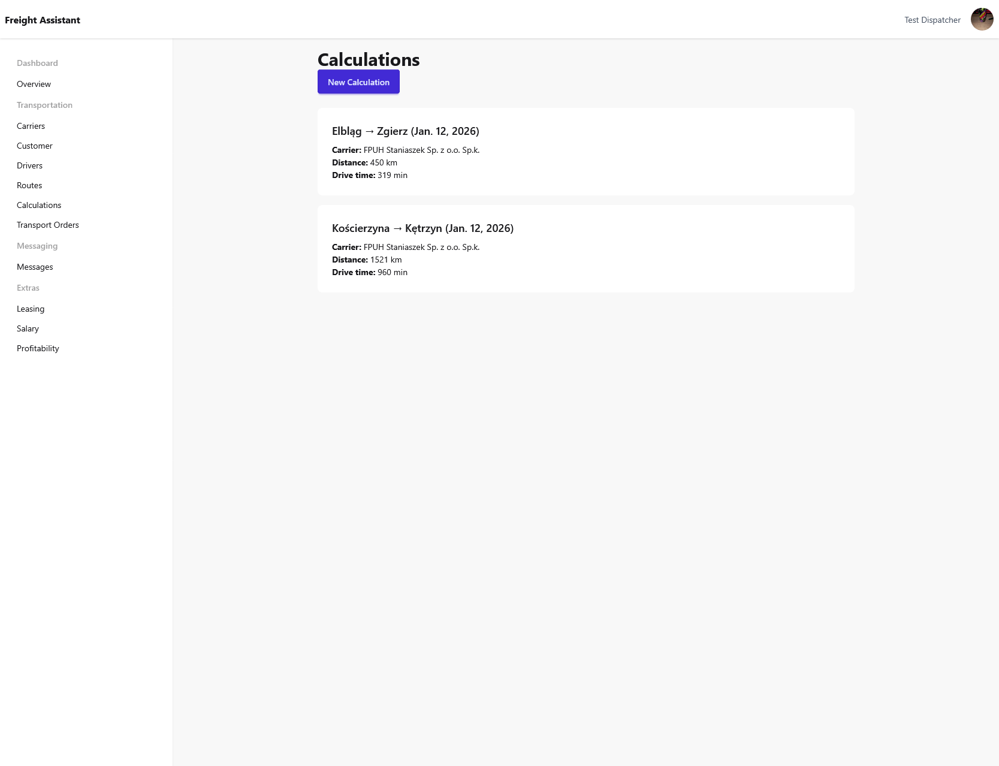
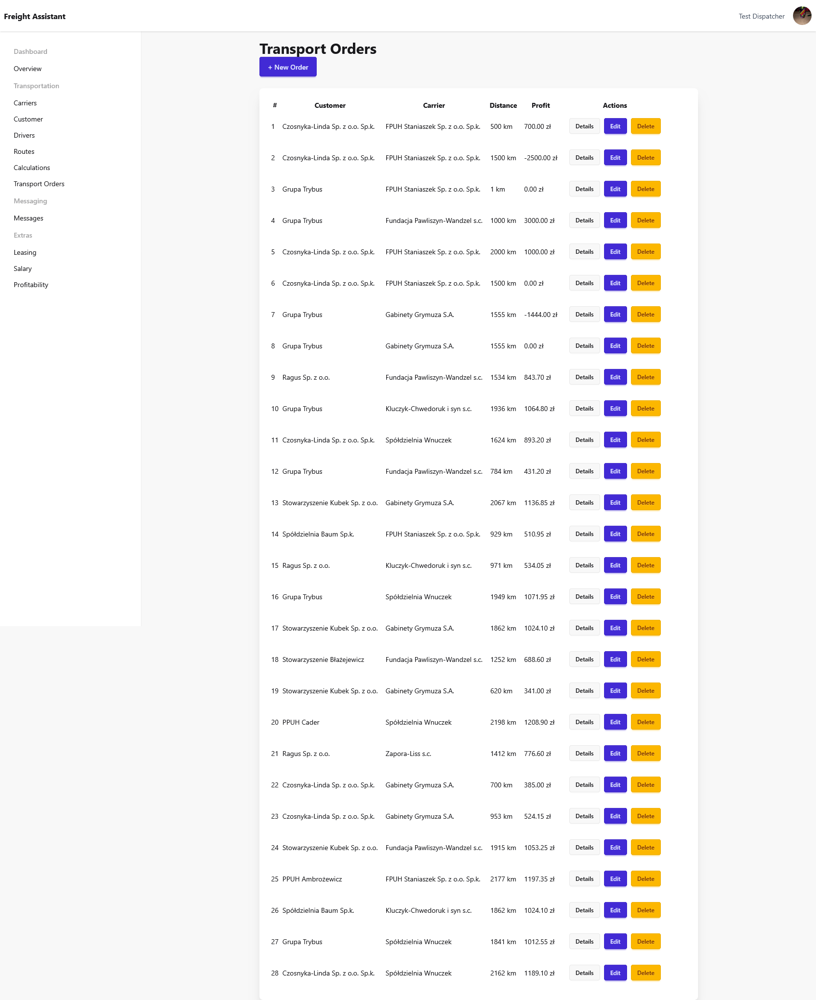

# Freight Assistant 🚛

**Freight Assistant** is a Django-based web application designed to support freight forwarders
in planning and validating truck routes according to **EU driving time regulations**.

The main goal of the project is to automatically calculate:
- driving time,
- mandatory breaks,
- daily and weekly rests,
- loading/unloading and administrative work,

so that a dispatcher can estimate a full transport schedule **in seconds instead of 1–2 hours of manual calculations**.

> ⚠️ The project is under active development. Core planning logic is already implemented and continuously refined.

---

## 🧠 What problem does this project solve?

In real-life freight forwarding:
- route planning must respect strict EU regulations (EC 561/2006),
- manual calculations are error-prone and time-consuming,
- even small mistakes can lead to fines or invalid schedules.

**Freight Assistant automates this process**, providing a realistic, dispatcher-oriented schedule
that can be relied on for operational planning.

---

## ⚙️ Key features (current)

✅ User-based data isolation (multi-user system)  
✅ Route creation with multiple stops (loading, unloading, partial operations)  
✅ Automatic distance & duration calculation using Google Maps API  
✅ Schedule builder respecting:
- 4.5h continuous driving limit,
- mandatory 45-minute breaks,
- daily and weekly rests,
- single-driver and double-driver crews  
✅ Clear breakdown of:
- driving time,
- breaks,
- rests,
- other work (loading / unloading / admin)  

---

## 🧮 How the schedule builder works (high-level)

1. The route is split into legs between stops.
2. Each leg’s distance and driving time is fetched from Google Maps.
3. Driving time is accumulated **across multiple legs** until it reaches 4h30.
4. Mandatory breaks are inserted automatically.
5. Loading/unloading time is treated as **work**, not rest.
6. Daily and weekly limits are enforced using planner-friendly heuristics.
7. The final result is a readable, step-by-step schedule.

The logic is implemented in a dedicated service:

---

## 🖼 Application screenshots

Below are example screenshots from the current development version of the application.
They illustrate the core features and overall UI structure.

---

### 📊 Calculations list
List of transport calculations with basic route and distance overview.

---

### 🧮 Calculation details & schedule
Detailed calculation view with:
- total distance,
- driving time,
- breaks,
- rests,
- and a step-by-step schedule generated according to EU regulations.

---

### 🚚 Transport orders list
Overview of transport orders with:
- customer,
- carrier,
- distance,
- and profit calculation.

---

### 📄 Transport order details
Detailed transport order view including:
- customer and carrier data,
- assigned drivers,
- pricing and profitability breakdown.

> Dates visible in screenshots come from development seed data (`populate.py`) and are used only for demonstration purposes.

---

## 🏗 Tech stack

- Python 3
- Django
- PostgreSQL
- Google Maps Platform:
  - Distance Matrix API (distance & travel time calculations)
  - Places Autocomplete API (validated address input for route stops)
- HTML / Django Templates
- Tailwind CSS (utility-based styling)

---

## 🚧 Project status

This project is **not finished yet**.

Planned features:
- PDF export of transport schedules,
- more accurate weekly rest compensation handling,
- improved UX for large multi-stop routes,
- automated tests for schedule logic.

The repository is intended as a **portfolio project** demonstrating:
- backend logic,
- real-world business rules,
- clean Django architecture,
- incremental refactoring and bug fixing.

---

## 👤 Author

Created by **Shizol01**  
Python / Django developer  